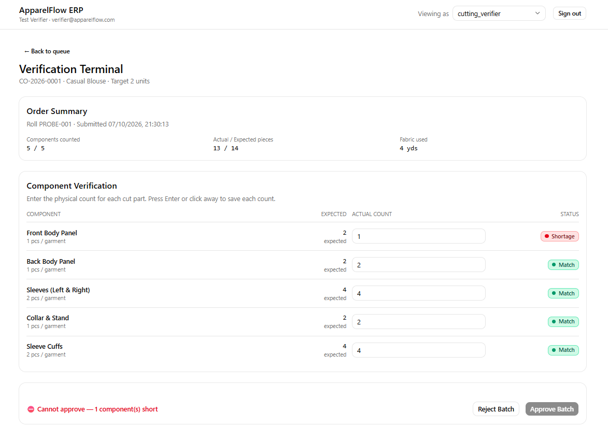

# ApparelFlow ERP - Cutting Verification Gate

Production Batch Verification & Sewing Queue Gate for ApparelFlow ERP. A manufacturing
resource planning module that enforces a server side hard stop preventing incomplete
cutting batches from reaching the sewing floor.

**Live Demo:** https://apparelflow-erp.netlify.app



## Documentation

- [`AI_OPTIMIZATION_REPORT.md`](./AI_OPTIMIZATION_REPORT.md) — AI usage audit
- [`docs/`](./docs) — architecture diagrams and schema documentation
- [`docs/SECURITY.md`](./docs/SECURITY.md) — RBAC matrix and tamper resistance

## Core Business Problem

In garment manufacturing, the Cutting Department is the single most critical quality checkpoint. If a cut bundle reaches the high-speed sewing floor with a component shortage, the entire assembly line grinds to a halt; incomplete garments pile up, fabric is wasted, and shipping deadlines are missed.

This application digitizes the physical factory SOP that prevents that failure: **zero unverified, mismatched, or shortage batches may ever enter the Sewing Queue**, enforced as a non-bypassable server-side hard stop.

```
┌─────────────────────────────────────────────────────────────────┐
│                    GARMENT FACTORY FLOOR                        │
│                                                                 │
│   FABRIC ROLLS                                                  │
│   (Raw Material)                                                │
│        │                                                        │
│        ▼                                                        │
│   ┌──────────────┐     ┌──────────────────┐     ┌────────────┐  │
│   │   CUTTING    │────▶│   VERIFICATION   │────▶│   SEWING  │  │
│   │  DEPARTMENT  │     │       GATE       │     │   FLOOR    │  │
│   │              │     │                  │     │            │  │
│   │ Supervisor   │     │ Verifier counts  │     │ Supervisor │  │
│   │ creates      │     │ each component   │     │ receives   │  │
│   │ batches      │     │ against recipe   │     │ verified   │  │
│   │              │     │                  │     │ batches    │  │
│   └──────────────┘     └────────┬─────────┘     └────────────┘  │
│                                 │                               │
│                          THE HARD STOP                          │
│                    ┌────────────▼────────────┐                  │
│                    │  ANY RED COMPONENT?     │                  │
│                    │  → BLOCK SEWING QUEUE   │                  │
│                    │  → FORCE REJECTION      │                  │
│                    └─────────────────────────┘                  │
└─────────────────────────────────────────────────────────────────┘
```

### Tech stack

```
| Layer    | Choice                                                 | Why                                                                       |
| -------- | ------------------------------------------------------ | ------------------------------------------------------------------------- |
| Frontend | React 18 + Vite + TypeScript + Tailwind v4 + shadcn/ui | Fast HMR, first-class TS support, accessible components                   |
| Backend  | Node.js + Express + TypeScript                         | Explicit request lifecycle, easy to reason about security boundaries      |
| Database | Supabase PostgreSQL (session pooler)                   | Real relational DB, generous free tier, connection pooling for serverless |
| ORM      | Drizzle + drizzle-kit                                  | SQL-like, type-safe, minimal magic, migrations as plain SQL               |
| Auth     | JWT (HS256) + bcrypt                                   | Stateless session, server-derived identity, no client trust               |
| Testing  | Vitest + Supertest                                     | In-process integration tests against the real DB                          |
| Deploy   | Netlify (static + functions)                           | Zero-cost, single-provider, no cross-origin complexity                    |
```

## Demo Credentials

```
Role	                      Email	                 Password

Cutting Supervisor	supervisor@apparelflow.com	 Password123
Cutting Verifier	  verifier@apparelflow.com	 Password123
Sewing Supervisor	  sewing@apparelflow.com	 Password123
```

## The Gatekeeper Hard Stop

A batch can only be approved when **every** component is counted and none is RED. Rejection requires a non-empty reason. Both rules are enforced at four layers:

1. **UI** — Approve button disabled with an explanatory reason (an affordance)
2. **Zod** — Request body validated for shape (400 on any violation)
3. **RBAC** — `requireRole('cutting_verifier')` rejects other roles (403)
4. **Service** — `evaluateApproval` inside the DB transaction recomputes traffic lights from `expectedQty`/`actualQty` and rejects on any shortage, missing row, or uncounted item (422)

Layers 3 and 4 are the boundary. Layers 1 and 2 are quality of life.

## Local Development

### Prerequisites

- Node.js 20+
- A Supabase project (free tier is sufficient)

### Setup

```
git clone https://github.com/mihiranga-dev/apparelflow-erp.git
cd apparelflow-erp
npm install
npm run build:shared
```

Create `server/.env` from the template and fill in your Supabase connection string plus a randomly generated JWT secret:

```
cp server/.env.example server/.env
node -e "console.log(require('crypto').randomBytes(48).toString('base64'))"
```

Then push the schema and seed the demo data:

```
npm run db:migrate
npm run db:seed
```

### Run

```
npm run dev
```

- API → http://localhost:4000
- Web → http://localhost:5173

### Test

```
npm test
```

48 tests across unit (`evaluateApproval`) and integration suites. Integration tests run against a real PostgreSQL database — set `NODE_ENV=test` and a `DATABASE_URL` in `server/.env.test`. The test setup file refuses to run if `NODE_ENV` is not `test`, because the suite truncates tables.

## Project Structure

```
apparelflow-erp/
├── packages/shared/       Contract types shared by server and client
│   └── src/
│       ├── roles.ts       UserRole union + runtime guard
│       ├── status.ts      OrderStatus, ComponentStatus enums
│       ├── domain.ts      evaluateComponentStatus, calculateWastagePct, hasAnyShortage
│       └── api.ts         Request/response DTOs
├── server/                Express API
│   ├── src/
│   │   ├── app.ts         Express app factory (used by index.ts and tests)
│   │   ├── index.ts       Server bootstrap
│   │   ├── config/env.ts  Zod-validated environment config
│   │   ├── db/            Drizzle schema, client, seed
│   │   ├── lib/           JWT sign/verify, asyncHandler
│   │   ├── middleware/    requireAuth, requireRole
│   │   ├── routes/        auth, recipes, orders, verification, verification-items, sewing
│   │   └── services/      verification.ts — gatekeeper logic + transactions
│   └── tests/             48 Vitest + Supertest tests
├── client/                React SPA
│   └── src/
│       ├── lib/           api client, auth context, endpoint helpers
│       ├── pages/         Login, Supervisor, Verifier, Sewing dashboards
│       └── components/    Terminal, traffic lights, forms, badges, shell
├── netlify/
│   └── functions/api.ts   Express → Netlify Function adapter
├── scripts/
│   ├── dev-tokens.mjs     Generates JWTs for all three demo users
│   └── rbac-probe.mjs     30+ role × endpoint assertions
└── docs/SECURITY.md       Full RBAC matrix and tamper resistance
```
