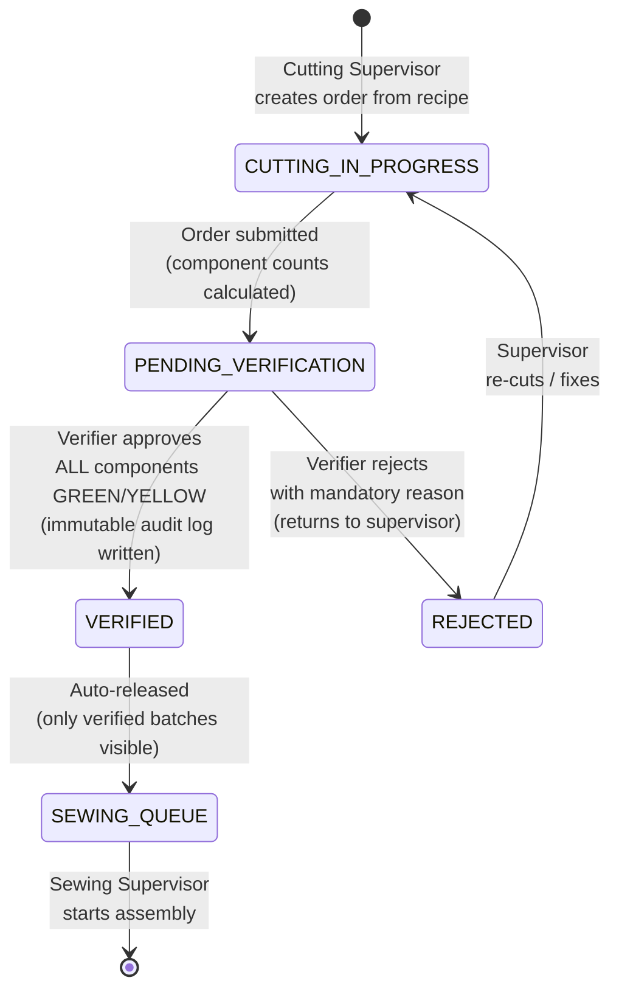

```mermaid
stateDiagram-v2
    [*] --> CUTTING_IN_PROGRESS : Cutting Supervisor<br/>creates order from recipe

    CUTTING_IN_PROGRESS --> PENDING_VERIFICATION : Order submitted<br/>(component counts calculated)

    PENDING_VERIFICATION --> VERIFIED : Verifier approves<br/>ALL components GREEN/YELLOW<br/>(immutable audit log written)

    PENDING_VERIFICATION --> REJECTED : Verifier rejects<br/>with mandatory reason<br/>(returns to supervisor)

    REJECTED --> CUTTING_IN_PROGRESS : Supervisor<br/>re-cuts / fixes

    VERIFIED --> SEWING_QUEUE : Auto-released<br/>(only verified batches visible)

    SEWING_QUEUE --> [*] : Sewing Supervisor<br/>starts assembly
```
